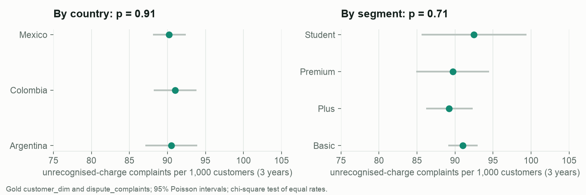
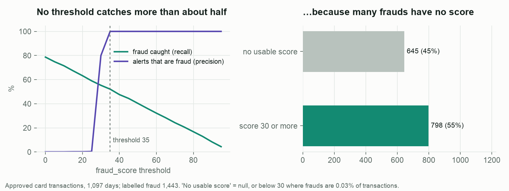
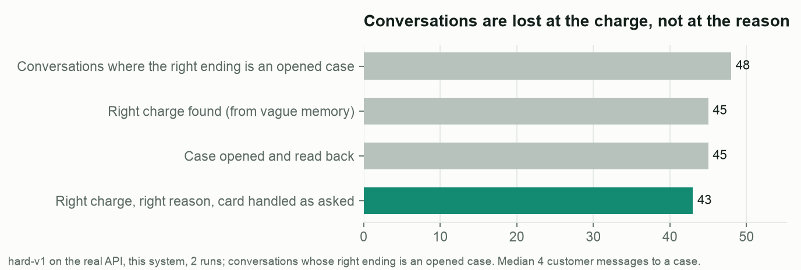
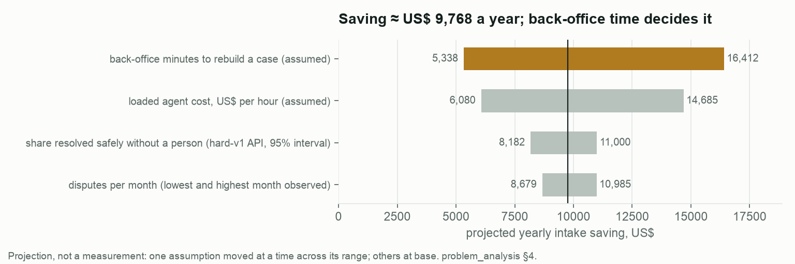

# Operating insights — what is real, what is noise, what it changes

Generated by `python -m dispute_ops.pipeline.insights` from the silver and gold layers (organizer data, synthetic) and committed evaluation results. Tests are run on purpose: in a synthetic dataset a pattern can be an artefact of the generator, and a staffing decision should not rest on one.

| # | Insight | Evidence | Decision it changes |
|---|---|---|---|
| 1 | **Disputes follow the working week, not the hour.** Tuesday to Friday carry 2.02× Sunday's volume; hours are flat. | weekday χ² = 626.5 (6 df, p < 0.001); hour χ² = 22.2 (23 df, p 0.51) | Staff the human queue on a weekly curve; no shift-level peak to plan for |
| 2 | **Volume is flat.** No trend over 35 months; the channel mix did not move between 2024 and 2025. | slope +0.24 complaints/month (p 0.48); channel × year χ² = 3.3 (p 0.65) | Capacity is a constant, not a forecast problem; the business case can use the observed range (335–424/month) |
| 3 | **Every country and segment disputes at the same rate** (~90 per 1,000 customers in three years). | country χ² p = 0.91; segment χ² p = 0.71 | No segment-specific risk rule is justified; the one country-specific rule (amount threshold in local currency) was replaced by a single USD threshold (ADR-013) |
| 4 | **The fraud-alert threshold is not the lever; coverage is.** 645 of 1,443 labelled frauds (45%) have no usable score (307 null, the rest below 30 among 1,136,905 legitimate transactions), so no workable threshold alerts on them. At the current threshold (35) the bank sends 0.69 alerts a day at 100% precision and catches 52% of fraud; the best any threshold does at ≥ 50% precision is 55%. | approved card transactions over 1,097 days ([figure](../figures/fraud_threshold_capacity.png)) | The alert channel costs almost no agent time; the next investment is scoring the unscored transactions, and the customer-initiated dispute path remains the safety net for the other half |
| 5 | **The service loses conversations at the charge, not at the reason.** Of 48 conversations that should end in a case, 45 found the right charge from vague memory, 45 opened and verified a case, 43 were fully right. A case takes a median of 4 customer messages (3–5). | hard-v1 on the real API ([figure](../figures/product_funnel.png)) | Improve charge search (amount and date tolerance, merchant aliases) before the reader; a registered case in about four messages replaces a 37-hour wait for a first answer |
| 6 | **The business case depends most on back-office time, which nobody has measured.** Base projection ≈ US$ 9,768 a year at the observed volume. | one-at-a-time sensitivity ([figure](../figures/saving_sensitivity.png)); automation share 73% (95% interval 62%–83%, hard-v1 API, n = 64) | Measure the back-office minutes per case in the pilot before promising savings |

## Details

### Dispute rate by group

| Group | Customers | Disputes | Per 1,000 | 95% interval |
|---|---|---|---|---|
| Argentina | 29,842 | 2,701 | 90.5 | 87.1–93.9 |
| Colombia | 45,251 | 4,119 | 91.0 | 88.2–93.8 |
| Mexico | 74,907 | 6,760 | 90.2 | 88.1–92.4 |
| Basic | 89,756 | 8,172 | 91.0 | 89.1–93.0 |
| Plus | 37,547 | 3,351 | 89.2 | 86.2–92.3 |
| Premium | 15,207 | 1,364 | 89.7 | 84.9–94.5 |
| Student | 7,490 | 693 | 92.5 | 85.6–99.4 |

### Fraud-alert threshold

| Threshold | Alerts per day | Precision | Recall |
|---|---|---|---|
| 0 | 1037.59 | 0% | 79% |
| 20 | 346.13 | 0% | 63% |
| 25 | 173.54 | 0% | 59% |
| 30 | 0.91 | 80% | 55% |
| 35 | 0.69 | 100% | 52% |
| 40 | 0.63 | 100% | 48% |
| 50 | 0.53 | 100% | 40% |
| 70 | 0.32 | 100% | 24% |
| 90 | 0.11 | 100% | 8% |

### Product funnel and hand-offs

| Step | Conversations |
|---|---|
| Conversations where the right ending is an opened case | 48 |
| Right charge found (from vague memory) | 45 |
| Case opened and read back | 45 |
| Right charge, right reason, card handled as asked | 43 |

Hand-off reasons across all 72 conversations: amount_above_threshold 6, customer_requested_human 5, regulatory_or_legal_threat 4, suspicious_access 1.

### Business-case sensitivity (projection)

| Assumption | Range | Saving at low | Saving at high |
|---|---|---|---|
| back-office minutes to rebuild a case (assumed) | 5–30 | US$ 5,338 | US$ 16,412 |
| loaded agent cost, US$ per hour (assumed) | 5–12 | US$ 6,080 | US$ 14,685 |
| share resolved safely without a person (hard-v1 API, 95% interval) | 0.615–0.827 | US$ 8,182 | US$ 11,000 |
| disputes per month (lowest and highest month observed) | 335–424 | US$ 8,679 | US$ 10,985 |

Limits: synthetic data (outcome fields are generator noise, ADR-021); the funnel comes from simulated customers; savings are projections from stated assumptions, never measurements.
