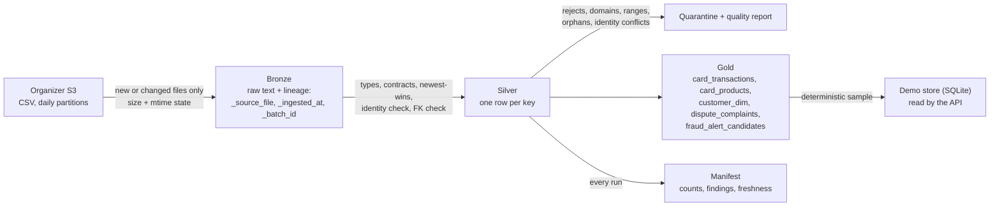

# ADR-012 — Data pipeline: SQL contracts in DuckDB, incremental ingestion, recomputed silver
- **Status:** accepted · **Date:** 2026-09-26 · supersedes the Pandera part of ADR-006

## Context
About 19M rows of daily-partitioned CSV with intentional duplicates, nulls, late arrivals and schema evolution. Real values diverge from the data dictionary (e.g. `branches.country = "México"`, `geographic_zone = "Urbana"`, `document_type = "Pasaporte"`).

## Decision
- **Declarative contracts** (`pipeline/contracts.py`): type, required, domain, range, primary key, newest-wins ordering, foreign keys, and which FKs are essential to the use case — taken from dictionary v1.0.0. Checks run as SQL in DuckDB, not Pandera: validating 4.4M transactions in pandas would be slow and memory-hungry.
- **Bronze:** raw text plus lineage (`_source_file`, `_ingested_at`, `_batch_id`), one Parquet per batch. Only new or changed files are read (size + mtime in `_state/bronze_files.json`). Malformed lines are counted (rejects), never silently dropped.
- **Silver:** recomputed from all bronze on every run:
  - types via `TRY_CAST`, failures counted;
  - dedup by primary key preferring the newest `process_date`/`last_updated`, then the newest ingestion — late arrivals and corrected re-deliveries are handled **by construction**;
  - orphan on an **essential** FK → quarantine; orphan on any other FK → set to NULL; both counted.
- **Gold:** `card_products`, `card_transactions` (with `amount_usd` filled and its source), `customer_dim` (canonical country, repeat-complainer flag), `dispute_complaints`, `fraud_alert_candidates`.
- **Export:** a deterministic customer sample to SQLite for the demo (`DEMO_DB`), used by the API as a private copy.
- **Lineage and freshness:** one manifest per run with per-layer counts and contract findings. Proposed policy: a daily batch after each `process_date` closes; late files are absorbed on the next run.

## Consequences
- Re-running without new files is idempotent (tested).
- Update correctness is tested with a **clearly labelled synthetic fixture** (`tests/fixtures/raw_mini`): a late file for an earlier day, a corrected re-delivery and a new column. A real earlier version of the dataset (`data_backup_20260831/`) is also available to validate this with organizer data.
- Findings on the full data: 99.99% of customers point to a non-existent registration branch (a generator defect, hence "essential FK" rather than "required column" decides quarantine); no duplicates were found in any table despite the dictionary's ~2%.
- Spanish domain values that diverge from the dictionary are reported, not silently fixed in silver; business normalisation happens in gold.

## Addendum (2026-09-28): the missing duplicates, verified twice
The dictionary promises ~2% duplicates; the pipeline removes none. To rule out a weak check, the raw CSVs were queried
directly (DuckDB over `data/raw/transactions/**/*.csv`, 4,425,008 rows): 4,425,008 distinct `transaction_id`, and 0
duplicate rows on every column except the id and the partition columns (`process_date`, `year`, `month`, `day`) — so
there are no re-delivered copies under new ids either. Complaints: 67,095 rows, 67,095 distinct ids. The delivered
data also has fewer rows than documented (transactions 4.43M vs 5M, call-center 686k vs 800k, complaints 67k vs 80k).
We report this rather than inventing duplicates; the dedup logic is exercised by the synthetic fixture instead.

## Tables not in the pipeline, and why
| Table | Rows | Why not ingested |
|---|---|---|
| `call_transcripts` | 200k | 42 distinct customer texts and one intent value: no usable language signal (ADR-019). Read once for that audit. |
| `satisfaction_surveys` | 250k | Read for the learnability scan and the CSAT finding (ADR-021); not needed at run time. |
| `digital_events` | 10M | Login and app events could feed an account-takeover signal (`ip_country_mismatch` exists in the policy), but the demo's test identity provider replaces them; ingesting 3.5 GB was not worth it for the workflow. |
| `service_agents` | 1.2k | Agent routing and staffing are out of scope; the handoff goes to one queue. |
| `marketing_campaigns`, `campaign_sends` | 200 · 2M | Commercial data unrelated to disputes; campaign conversion was checked in the learnability scan only. |

## Addendum (2026-09-29): identity is immutable, freshness is checked, and the organizer's backup is not an earlier version

**Re-delivery contract.** Newest-wins deduplication handles late and corrected files, but it would also accept a
correction that changes *who owns what*. Each contract now lists immutable identity columns (customers: document number,
date of birth; products: owning customer, card number; transactions: customer, product; complaints: customer). A key
whose versions disagree on one of them is quarantined (`silver/_quarantine/<table>__immutable_<col>.parquet`, counted as
"identity conflicts" in the quality report) instead of taking the newest value. Test:
`test_a_redelivery_that_moves_a_card_to_another_customer_is_quarantined` (a mutable field in the same delivery still
updates).

**What the real data showed.** The organizer bucket has an earlier snapshot, `data_backup_20260831/` (the six dimension
tables only). Loading it first and the current delivery second, as a re-delivery:

| | Shared ids | Only in one snapshot | Shared ids whose identity changed |
|---|---|---|---|
| customers | 4,025 of 150,000 | 145,975 each side | 1,052 document numbers |
| products | 128,599 of 400,000 | 271,401 each side | **128,599 owners (all of them)**, 7,151 card numbers |

The backup is a different synthetic generation, not an earlier state of the same records: every product id the two
share belongs to a different customer. Under plain newest-wins, a mixed load would have silently moved 128,599 cards —
and their charges and disputes — to other people. With the contract, those keys are quarantined and reported. The
current delivery alone has no identity conflicts, so the demo and every evaluation are unaffected.

**Freshness.** Each run reports, per fact table, the newest `process_date`, its lag behind the run and the rows processed
more than a day after the event (`check_freshness`; status "stale" beyond 2 days). On the current data every table is
fresh and **no row arrives late**: `process_date` equals the event date for all transactions, complaints and calls,
despite the dictionary's note on late arrivals. The late-arrival path stays tested on the labelled fixture.

