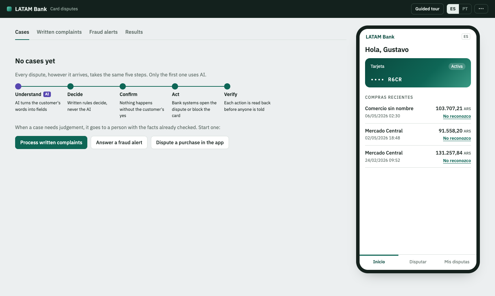
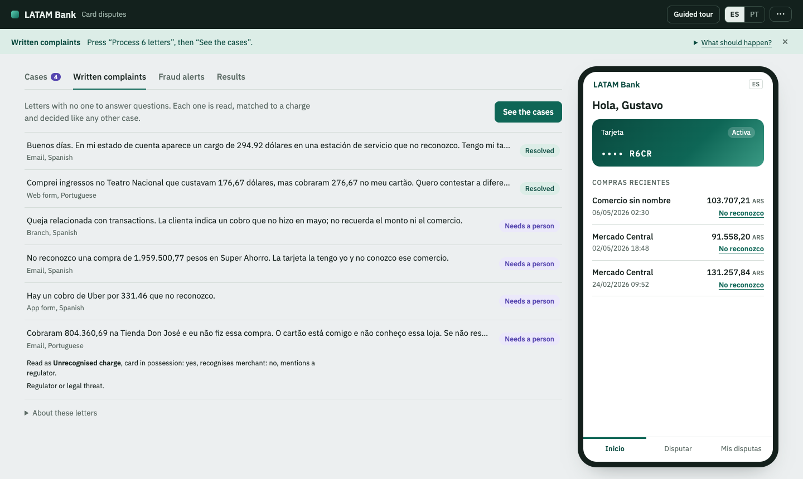
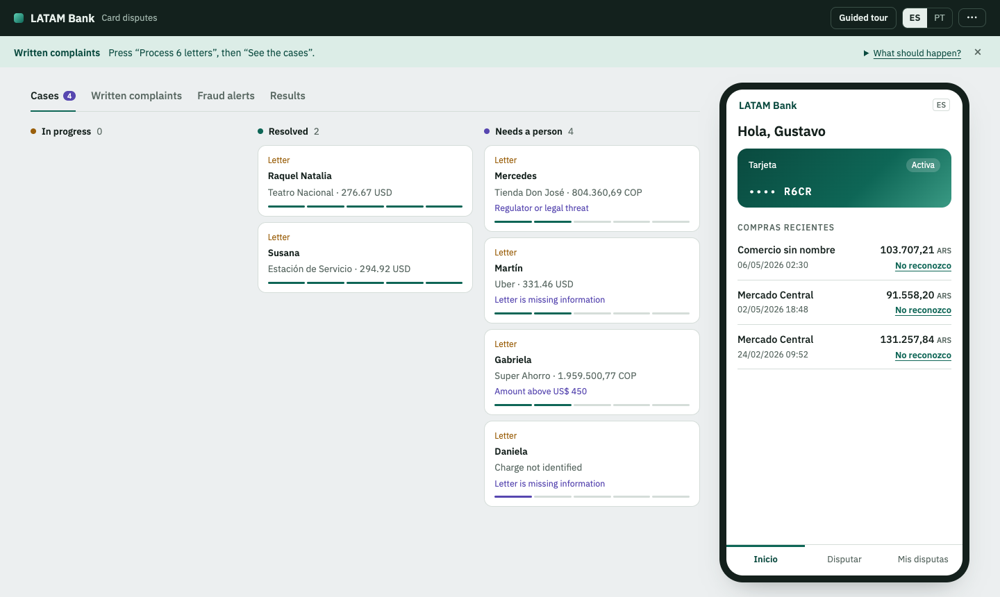
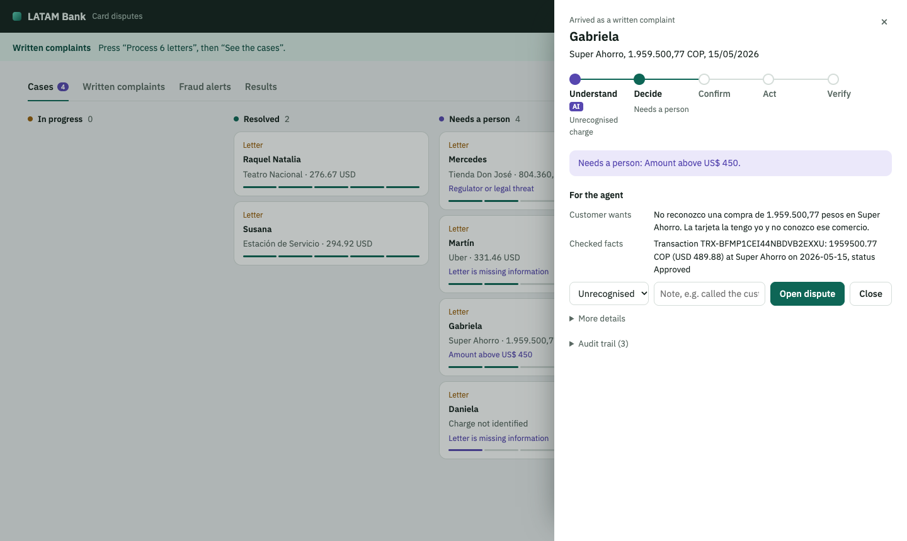
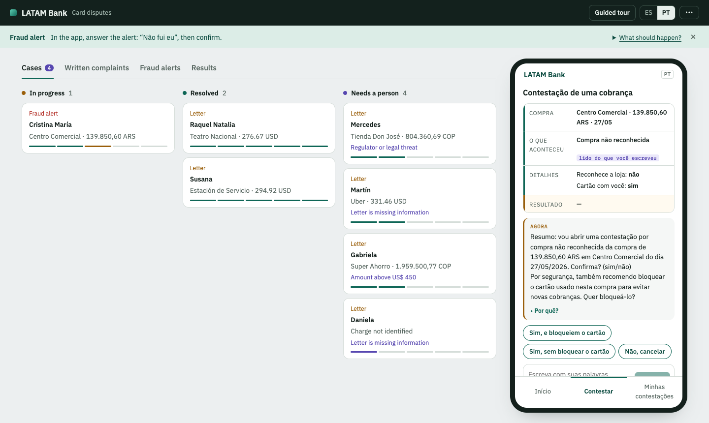
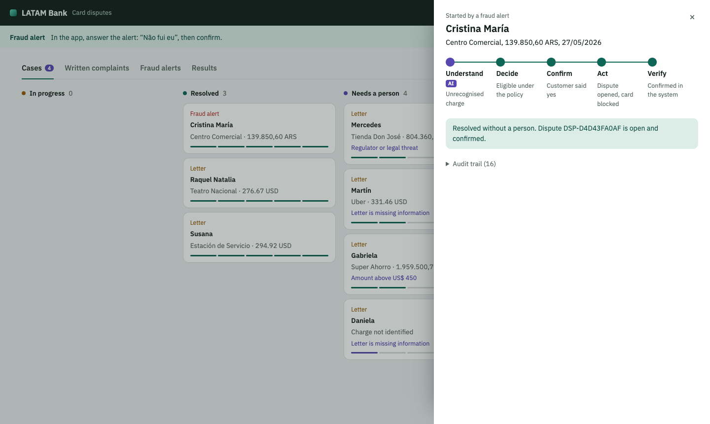

# Demo walkthrough

What a judge sees on <https://latam-bank-disputes.vercel.app>, step by step, captured from the running app. The bank's
view leads; the customer's app is one channel on the right. Everything below runs on the organizer's synthetic data
with no AI cost (the free reader); with an API key, Claude reads the customers' words instead.

## 1. The bank opens on its case board

Every dispute, however it arrives, takes the same five steps; only the first uses AI. Three buttons start a case:
written complaints, a fraud alert, or a purchase disputed in the app. **Guided tour** in the top bar lists all seven
scenarios; the **⋯** menu holds the demo controls (switch customer, simulate an AI outage, expire the session, reset).

## 2. Written complaints are read and decided with nobody to ask

Six letters (email, web form, branch, app; Spanish and Portuguese) go through the same case engine: the letter is read,
matched to a charge from the complaint's structured fields, and decided by the policy. Two open without a person; four
go to a person, each with its reason. Click a letter to see how it was read.

## 3. Every case, from every channel, on one board

In progress, resolved, needs a person (and closed, when there are any). Each card shows where the case came from and a
five-segment bar of the steps it reached.

## 4. A case that needs a person arrives ready to act on

The drawer shows the case's path (AI understood an unrecognised charge; the policy sent it to a person because the
amount is above US$ 450), what the customer wants, the facts checked against the bank's records, and the agent's two
actions. Rules, risk signals and the append-only audit trail are one click away.

## 5. The customer's app has no chat window

The bank asked first (fraud alert). The customer said "não fui eu"; the dispute form fills itself: the charge from the
bank's records, the reason read from what the customer wrote, the details, and one question at a time. Nothing opens
until the customer confirms, and the card is blocked only if they choose it.

## 6. Resolved, and verified before anyone is told

All five steps done: the dispute was opened and the card blocked, both read back from the bank's systems before the
customer saw "done".
