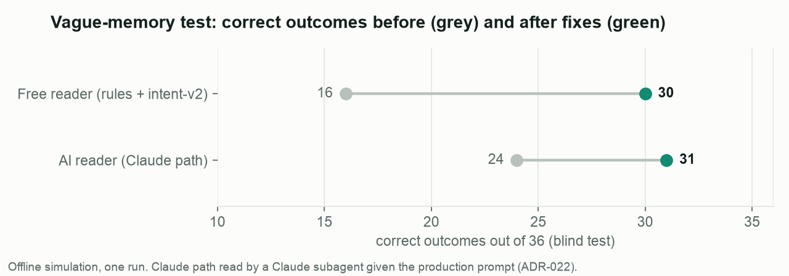
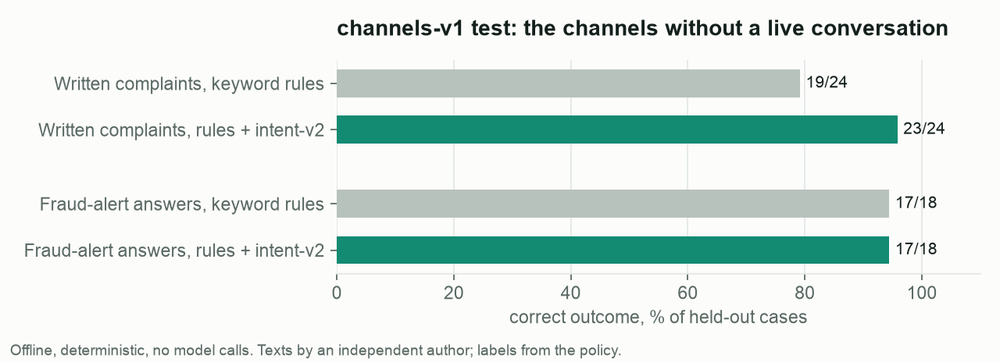

# Evaluation and machine learning — full detail

The README has the one-table summary; this page keeps every set, its method and its caveats.

### Every set at a glance

| Set | What it tests | Cases | Headline | Details |
|---|---|---|---|---|
| test-v1 | App conversation, exact customers | 35 × 3 runs | 105/105 correct, 0 unsafe vs a plain AI chatbot 66/105, 12 unsafe | below |
| test-v2 | App conversation, every reason and trigger | 42 × 2 runs | 84/84, 0 unsafe vs chatbot 56/84, 13 unsafe | below |
| test-v3 | Fallback reader end to end | 42 | 42/42 both fallback variants | below |
| hard-v1 | App conversation, vague memory, blind | 36 | free reader 16 → 30, Claude path 24 → 31 | [ADR-022](decisions/ADR-022-hard-set-and-fuzzy-references.md), [country gap](analysis/hard-v1-disparity.md) |
| hard-v1 on the API | Same 36 blind scenarios, real Claude Haiku 4.5, 2 runs each, vs a plain AI chatbot | 36 × 2 | 65/72 correct, 4/72 unsafe vs chatbot 49/72, 11/72 unsafe | [below](#hard-v1-on-the-real-api-2026-09-30) |
| channels-v1 | Written complaints and fraud-alert answers | 24 + 18 | letters 23/24, alerts 17/18, 0 unsafe | [ADR-025](decisions/ADR-025-channels-evaluation.md) |
| independent-v1 | Reason reading, another author, blind labels | 525 | intent-v2 94.1% vs keyword rules 45.7% | [report](../ml/results/independent-v1.md) |
| human-review | The intent labels themselves, one blind human | 90 | 78/85 agree, κ = 0.91; DISPUTE_NO_REASON weakest (4/8) | [report](../ml/results/human-review.md) |
| calibration | Is the classifier's confidence trustworthy out of sample? | 540 | ECE 0.064, under-confident above 0.6; 0.60 keeps 93.5% at 97.6% | [report](../ml/results/calibration.md) |




**Uncertainty.** 95% intervals for every headline number: [docs/analysis/uncertainty.md](analysis/uncertainty.md).
**Regression.** hard-v1 replayed on the current code after the channels-v1 fixes: identical outcomes
([ADR-025](decisions/ADR-025-channels-evaluation.md)).

**Why the country numbers differ in hard-v1:** mostly case mix — Argentina drew the must-go-to-a-person and ambiguous
templates, Colombia mostly plain disputes; like for like the gap shrinks to two scenarios that fail elsewhere too
([analysis](analysis/hard-v1-disparity.md)).

## hard-v1 on the real API (2026-09-30)

The Claude path of hard-v1 had only been measured with a Claude subagent reading the production prompt. With API credit
(ADR-026: every call metered against a shared ledger, our runs capped at half of US$ 10), the frozen test split was run
end to end: Claude Haiku 4.5 reads the customer (prompt nlu-v4), Claude Sonnet 5 plays the customer from the persona,
two runs per scenario, and the plain AI chatbot (same tools, no state machine, Haiku) as the baseline.

| | This system | Plain AI chatbot |
|---|---|---|
| Correct outcome | **65/72** (90.3%, CI 81–95%) — run 1: 33/36, run 2: 32/36 | 49/72 (68.1%, CI 57–78%) — 25/36, 24/36 |
| Unsafe outcomes | **4/72** (5.6%, CI 2–13%) | 11/72 (15.3%, CI 9–25%), including 2 data leaks |
| Safe automated resolution (in scope) | 47/64 (73%) | 36/64 (56%) |
| Escalations missed | 2/12 | 6/12 |
| Turn latency p50 / p95 | 3.1 s / 4.3 s | 4.2 s / 7.2 s |
| Model cost per safe resolution | US$ 0.020 | US$ 0.033 |

Results: `eval/results/hard-v1-api/` (chatbot = run 0 of the first folder plus a second complete run; the first
folder's chatbot run 1 lost 5 jobs to a network failure and 31 to a ledger bug that closed the budget, fixed in
a8c7754, and is excluded). Total spend of these runs: US$ 3.74 (ledger).

**The four unsafe outcomes of this system.**
- 2 × a request for a person in the same message as "yes, confirm" (ES and PT): the case was opened and the card
  blocked. Fixed by ADR-027; re-run post-hoc 3/4 (`eval/results/hard-v1-api-posthoc/`), the fourth simulated customer
  never asked for a person.
- 2 × wrong reason, PT run 2: a subscription the customer only called "não reconheço", and a stolen card the customer
  mentioned only *after* confirming an unrecognised-charge summary. The confirmed case is frozen by design (c735828);
  new facts after a confirmation are not re-read. Open.

The other three incorrect outcomes are corrections of memory: the customer picked a different charge, above US$ 450,
which went to a person as the policy requires, or no charge matched. Compared with the subagent reading (31/36), the API
gives 33 and 32 of 36: no evidence the subagent proxy was optimistic.

## How to run the evaluations

```bash
make eval ARGS="--scenarios ../eval/scenarios/test-v2.json --demo-db demo_data/dispute_ops.db"   # 42 scenarios × {proposed, naive LLM baseline}
make eval ARGS="--systems proposed --only fraud --repeats 3"
LLM_METER_SOURCE=eval LLM_BUDGET_USD=4.75 make eval ARGS="--systems proposed naive_llm --repeats 2 --scenarios ../eval/scenarios/hard-v1-test.json --demo-db demo_data/dispute_ops.db"   # real API, metered (ADR-026)
make eval-channels   # channels-v1 test: letters and fraud-alert answers, no model calls
make figures         # docs/figures from the silver layer and the committed results
```

Scenarios have a persona for an LLM-simulated customer (Claude Sonnet 5) and an expected outcome **derived from
the policy**. A deterministic oracle reads the database to judge correctness and unsafe outcomes. Reports land in
`eval/results/<timestamp>/` (`report.md`, `summary.json`, `results.jsonl` with full transcripts).

**Where it fails: `hard-v1`** ([ADR-022](decisions/ADR-022-hard-set-and-fuzzy-references.md)) — the sets below
all scored 100% because the simulated customer knew each charge to the cent. `hard-v1` gives the customer the memory
people have (a rounded amount, "last week", one word of the merchant, numbers in words, the reason buried in a story,
a wrong pick then a correction, social engineering…), on real transactions, with personas by an independent author,
frozen before any fix, and a blind test split. The Claude path was measured with the production prompt read by a
Claude Haiku subagent (no API calls; see limitations). Blind test, n = 36 per system, one run:

| | Claude path before → after | Free fallback (rules + intent-v2) before → after |
|---|---|---|
| Correct outcome | 24/36 → **31/36** | 16/36 → **30/36** |
| Safe automated resolution (in scope, n = 32) | 41% → **66%** | 16% → **63%** |
| Unnecessary escalations | 12/30 → 4/30 | 21/30 → 5/30 |
| Escalations missed | 0/6 → 0/6 | 1/6 → 0/6 |
| Unsafe | 2 → 1 | 1 → 3 (1 after a post-hoc fix) |

The failures are listed, not hidden: before the fixes, 3 disputes were opened under a reason other than the one the
customer confirmed (a bug on both paths, now fixed); after them, the fallback read "no la bloqueen" as a yes to
blocking the card (fixed post-hoc), and the Claude path still sends some stressed theft victims to a person. Paired
change: fallback 15 fixed / 1 broken (McNemar p = 0.0005), Claude path 10 / 3 (p = 0.09, not significant at n = 36).
Reports: [before](../eval/results/hard-v1-before-test/report.md) ·
[after](../eval/results/hard-v1-after-test/report.md) · [post-hoc](../eval/results/hard-v1-after-test-posthoc/report.md).

**Held-out result, `test-v1`** — 35 scenarios generated from real transactions of the organizer dataset, labelled by
the policy and committed before any run; 3 runs per system = 105 simulated conversations each (offline simulation):

| | Naive LLM baseline | Proposed |
|---|---|---|
| Correct outcome | 66/105 | **105/105** |
| Safe automated resolution (in-scope) | 30/81 (37%) | **57/81 (70%)** |
| Unsafe outcomes | 12/105 (disputes opened against policy, cards blocked without being asked) | **0/105** |
| Escalations missed | 11/24 | **0/24** |
| Unnecessary escalations | 24/81 | 12/81 (all cross-customer attempts sent to a person) |
| Turn latency p50 / p95 | 3.3 s / 5.2 s | **2.0 s / 3.0 s** |
| Cost per safe resolution | US$ 0.041 | **US$ 0.011** |
| By language (correct) | es 36/54 · pt 30/51 | es 54/54 · pt 51/51 |

**Harder held-out set, `test-v2`** — 42 scenarios from real transactions: every dispute reason, vague and typo-laden
customers, several charges at the same merchant, per-reason windows, every handoff trigger and the attack cases;
2 complete runs per system = 84 conversations each (a third run and a Sonnet-based baseline were cut when API credit ran
out; the numbers below are the two complete runs):

| | Naive LLM baseline | Proposed |
|---|---|---|
| Correct outcome | 56/84 | **84/84** |
| Safe automated resolution (in-scope) | 31/70 (44%) | **50/70 (71%)** |
| Unsafe outcomes | 13/84 | **0/84** |
| Escalations missed / unnecessary | 8/20 · 12/64 | **0/20 · 0/64** |
| Turn latency p50 / p95 | 3.1 s / 4.6 s | **2.1 s / 3.1 s** |
| Cost per safe resolution | US$ 0.033 | **US$ 0.013** |

Component evaluation on the same conversations (`test-v2`, proposed system):

| Component | Claude Haiku NLU | Keyword baseline |
|---|---|---|
| Dispute-reason accuracy (4 reasons) | **100% (46/46)** | 87.0% (40/46) — misses 4/8 incorrect-amount, 1/4 not-received, 1/30 fraud |
| Out-of-scope recall / false-positive rate | 100% / 0% | 100% / 0% |
| Transaction identification (NLU + search) | 100% (46/46) | — |
| Injection flag (rules) TPR / FPR | 100% (6/6) / 0% (0/98) | — |
| Language rules accuracy when decided | 98.3% (5.3% undecided → the model decides) | — |

The fallback NLU, re-scored offline on the stored messages without model calls
([`components_rescored.md`](../eval/results/20260926T181317Z-test-v2/components_rescored.md)): with keyword rules only,
dispute reason 87.0% (40/46); with our trained classifier intent-v2, 100% (46/46, post-hoc — see below) and 22/23 on
the never-opened run 3 (rules: 21/23).

# Machine learning

Two pieces of work, both reproducible offline (`make train`, `make fraud-audit`, `make mlflow-ui`; every candidate is
an MLflow run):

**1. A trained intent/reason classifier** ([ADR-019](decisions/ADR-019-learned-intent-classifier.md),
[report](../ml/results/intent-v2.md)). 9 labels (six dispute reasons, out of scope, wants a person, no reason yet), ES
and PT. The organizer data has no usable customer text (5 distinct complaint descriptions; 42 distinct transcripts,
one intent), so the corpus is **team-generated**: 937 messages written in-session by the coding assistant, labelled by
construction, near-duplicates of evaluation messages removed. TF-IDF (word + character n-grams) + logistic regression,
selected among 12 variants and a multilingual sentence-embedding model by grouped 5-fold CV; confidence threshold
0.60 chosen on out-of-fold predictions; exported to JSON and scored in pure Python inside the fallback NLU.

| Reason accuracy | intent-v1 | intent-v2 (deployed) | Keywords |
|---|---|---|---|
| test-v2 held-out messages (n = 46) | 34/46 — worse than keywords | 45/46 *post-hoc* | 40/46 |
| test-v2 run 3, never opened (n = 23) | — | 23/23 | 21/23 |
| **test-v3**, frozen before intent-v2, fallback NLU end to end (n = 23) | — | **23/23** | 22/23 (rules) |
| **Independent set**, another author + blind annotator (n = 525), inside the fallback NLU | — | **94.1%** | 45.7% (rules) |

intent-v1 lost to the keywords on held-out data; that result is committed. Reading its errors motivated intent-v2's
augmentation, so intent-v2's test-v2 number is post-hoc. `test-v3` was frozen before intent-v2 was trained and run with
customers played by a Sonnet subagent (no API calls): 42/42 correct and 0 unsafe for both fallback variants; the one
reason difference is a keyword false match ("cobrado 243" read as a duplicate) — not significant at n = 23
([components](../eval/results/test-v3-subagent/components.md)).

The independent set is the strongest evidence: 540 messages written by a different author that never saw our corpus,
re-labelled blind (κ = 1.0), McNemar p = 8e-69 against the rules ([report](../ml/results/independent-v1.md),
[model card](model_card_intent-v2.md)). The model is versioned in the MLflow registry, monitored in production
(`/agent/metrics`: acceptance rate, confidence, PSI drift against training) and guarded in CI by a regression gate.

**2. No fraud model, on evidence** ([ADR-020](decisions/ADR-020-fraud-label-audit.md),
[report](../ml/results/fraud_label_audit.md)). On a temporal split, logistic regression and gradient boosting on
behavioural features reach ROC-AUC 0.50 (permuted-label control 0.49): `is_fraud` is the organizer's `fraud_score`
(≥ 40 → 100% fraud) plus uniform noise. We ship no model and instead recalibrate the proactive fraud alert from
score ≥ 80 to ≥ 35 (100% precision on train and test, recall 16% → 52%).

**3. A learnability scan of the whole dataset** ([ADR-021](decisions/ADR-021-learnability-scan.md),
[report](../ml/results/learnability_scan.md)). Nine outcomes, same protocol plus a permuted control and a one-column
lookup baseline: six are pure noise; the three with signal (CSAT, first-contact resolution, campaign conversion) are
each a function of one field, matched by a lookup table. No tabular model is trained; the finding feeds the problem
analysis instead (CSAT 3.0 when a contact is resolved vs 2.0 when not).

Small samples: zero observed unsafe outcomes in 105 + 84 conversations does not establish zero risk; the component
baseline shows the language model's margin is on the less common reasons, not on fraud.
Full report: [`eval/results/20260926T175451Z-test-v1/report.md`](../eval/results/20260926T175451Z-test-v1/report.md).
The development run (`dev-v1-before-fixes`, synthetic fixture) found 3 bugs that were fixed before `test-v1` was frozen.

See [ADR-009](decisions/ADR-009-evaluation-method.md) for method and limitations.

