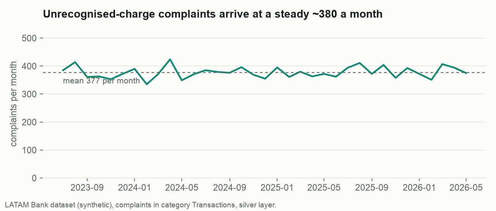
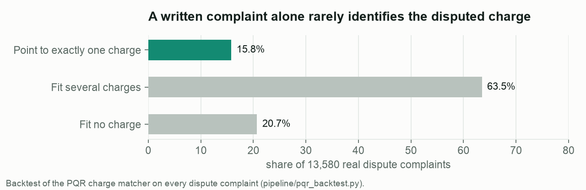
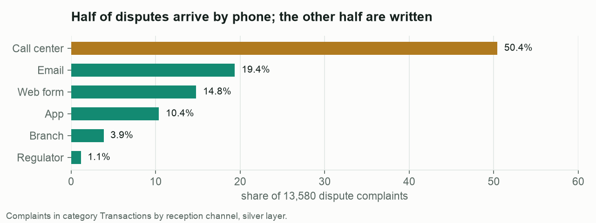
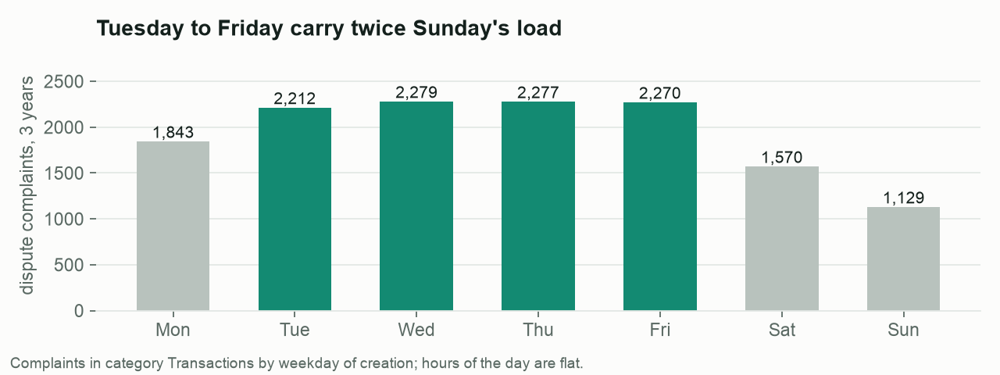
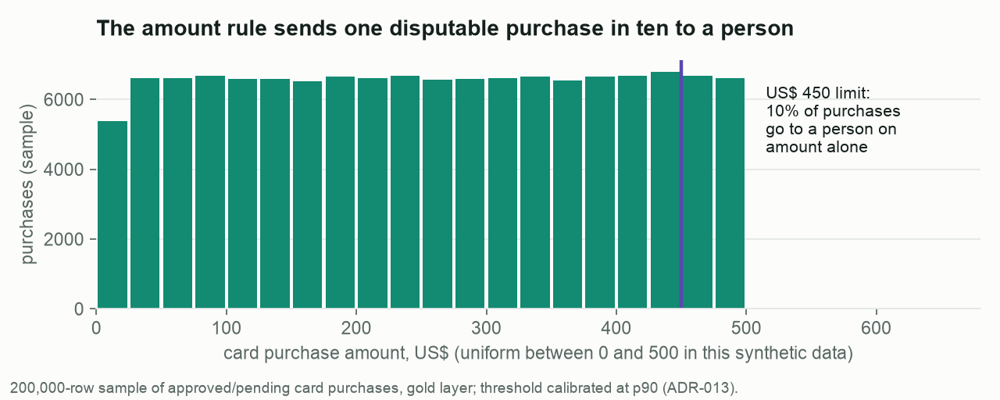
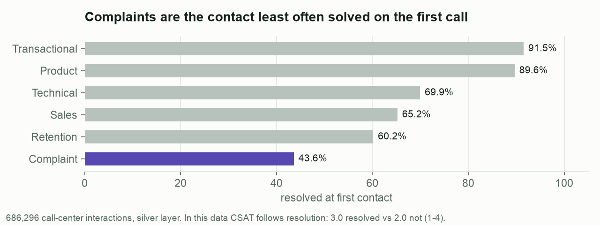
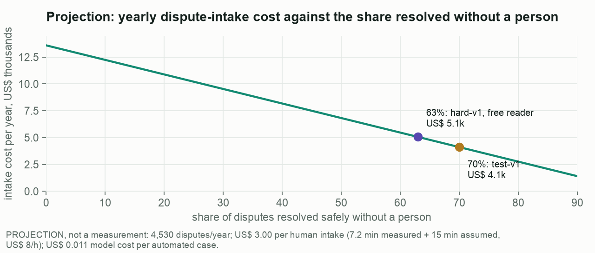

# Problem analysis — why card-charge disputes

All numbers come from the organizer dataset (LATAM Bank v1.0.0, synthetic, June 2023 – June 2026), computed on the
silver layer of our pipeline (`make data`; data quality in [`data_quality_report.md`](data_quality_report.md)).
Business figures in the last section are **projections from stated assumptions**, not measurements.

## 1. Disputes are a large, steady and slow-moving share of complaints

| Fact | Value |
|---|---|
| Complaints (PQR) in three years | 67,095 |
| Share in category `Transactions` | **20.2 %** (13,580) — its only subcategory is **"Cargo no reconocido"** (unrecognised charge) |
| Monthly volume | 335–424, mean **377 per month**, flat across 2023–2026 |
| Rate | ~30 disputes per 1,000 customers per year |
| How they arrive | Call center 50.4 % · email 19.4 % · web 14.8 % · app 10.4 % · branch 3.9 % · **regulator 1.1 %** |
| Current state | Status field: open 29.7 % + in process 39.8 % = 69.5 % not resolved; escalated 5.0 %; resolved/closed 24.6 %; rejected 0.9 %. **Not a backlog:** the open share does not fall with age (75 % of two-year-old complaints are still "open", while the recorded resolution times imply 0 %), so the status is a generator label, not a lifecycle ([insight 7](analysis/operating-insights.md)); it is not used as evidence here |
| First response | median **37 h**, p90 58 h |
| Time to resolution (resolved cases) | median **15 days**, p90 27 days |
| SLA breached | **~20 %** in every status |
| Resolution satisfaction | 3.09 / 5 |
| Compensation paid | 995 cases, mean 255 (local currency) |
| Repeat complainers among disputers | 14.7 % |

## 2. The intake is where the process breaks

Transaction complaints reach the back office **without the information needed to act on them**:

| Field needed to open a dispute | Missing |
|---|---|
| The disputed transaction (`transaction_id`) | **100 %** — the complaint schema has no such field |
| The affected product (`affected_product_id`) | 33.7 % |
| The claimed amount (`claimed_amount`) | 66.9 % |
| The originating interaction (`origin_interaction_id`) | 100 % |
| A usable description | 5 distinct templated texts in 67,095 complaints |

In the call center, complaint contacts (`Queja`, 117,021 interactions) have the **lowest first-contact resolution of any
reason: 43.6 %** (vs 91.5 % for transactional contacts), and the longest handle time after sales/retention: **7.2 minutes**.
Contact reasons are coarse (`contact_reason` equals `reason_category`, six values), so the bank cannot even tell a dispute
from other complaints at intake.

**Problem statement.** Customers who do not recognise a card charge wait a day and a half for a first answer and about two
weeks for a resolution. The root cause visible in the data is an intake that captures
neither the transaction, nor the reason, nor the evidence — so every case needs a person to reconstruct it.

### Backtest: can written complaints alone be tied to a transaction?

We applied the PQR channel's matching rule (`channels.match_complaint`, SQL twin in `pipeline/pqr_backtest.py`) to all
13,580 dispute complaints: the customer's approved/pending charges in the 120 days before the complaint, narrowed by the
affected product when it belongs to the customer and by the claimed amount (±1%).

| Outcome | Complaints | Share |
|---|---|---|
| Exactly one candidate (automatable) | 2,141 | **15.8 %** |
| Several candidates (median 2) | 8,625 | 63.5 % |
| No candidate | 2,814 | 20.7 % |

Two more data defects surfaced: **every** `affected_product_id` (9,001 of 9,001) belongs to a *different* customer than the
complainant, so the rule ignores foreign product references (in production this would be a security alert), and the claimed
amount never matches a transaction. **Conclusion: a written complaint cannot identify the disputed charge in 84 % of cases.**

The conversation is what closes that gap — it asks the customer which charge, from their own history. The PQR channel is kept
as triage: it resolves the matchable cases and hands the rest to an agent with the candidate shortlist attached.

## 3. What the service changes, and how it is measured

| Target outcome | Mechanism | Evidence |
|---|---|---|
| A complete, actionable case at the first contact | The conversation identifies the transaction from the customer's own history, classifies the reason code, collects the evidence the policy requires and opens the case | Held-out evaluation: transaction identification and reason accuracy (component report) |
| Minutes instead of 37 h to a registered case | Automated resolution when the policy allows; verified case id returned in the chat | Per-turn latency p50 ≈ 2 s; conversations of 2–5 turns |
| People only where they add value | Deterministic handoff triggers (amount, repeat complainer, regulator threat, security, failures) with a structured package | Missed and unnecessary escalations, measured |
| No new risk | Policy outside the model, confirmation before acting, verification before reporting | Unsafe outcomes counted with denominators, vs. an LLM baseline |
| Same treatment across countries | Single calibrated amount threshold (ADR-013) | Outcomes by country and segment |

## 3a. What the data says about running the service

**Where disputes come from decides what to automate next.** Half arrive through the call center, 35% as written text
(email and web form) and 10% in the app. The service covers the written half and the app; the phone half is the next
channel (a call transcript read into the same case engine), not a second product. The 1.1% that arrive through the
regulator always go to a person under the policy.

**Staff for Tuesday to Friday.** Dispute complaints peak Tuesday to Friday (about 2,260 per weekday over three years)
and halve on Sunday; hours of the day are flat. The agent queue the service leaves behind should be staffed on that
weekly curve.

**The amount rule is a capacity dial.** Card purchase amounts are uniform between US$ 0 and 500 in this data, so the
US$ 450 hand-off rule (set at the 90th percentile, ADR-013) sends exactly one disputable purchase in ten to a person
on amount alone, in every country. Moving the limit moves the queue linearly: each US$ 50 is about 10% of disputes.

**The lever on satisfaction is resolving at the first contact.** Complaints are resolved at first contact 43.6% of the
time, against 91.5% for transactional contacts; in this data CSAT depends on resolution alone (3.0 resolved vs 2.0
not, on 1–4; ADR-021). A dispute the service registers in the first conversation moves that contact into the
resolved group.

**Human workload (projection).** At 377 disputes a month and the conservative automation share (63%, hard-v1), about
140 cases a month still need a person, instead of 377: roughly 5–6 a day Tuesday to Friday. At 22 minutes of human work
per case (7.2 min measured contact + 15 min assumed back-office), that is about 2 agent-hours on a peak day, down from
about 5. Assumptions as in §4; not a measured production figure.

> Which of these patterns survive a statistical test, the fraud-alert capacity curve, the product funnel and the
> business-case sensitivity: [operating insights](analysis/operating-insights.md).

## 4. Customer and business outcomes (projection — assumptions stated)

Assumptions, all adjustable:
- Human cost of a dispute intake = one complaint contact (7.2 min, measured) + 15 min of back-office reconstruction
  (assumed), at a loaded agent cost of US$ 8 per hour (assumed for a LATAM contact center) → **≈ US$ 3.0 per dispute**.
- Share of disputes the service resolves safely without a person = the **offline** result on the hardest held-out set
  (63 %, `hard-v1`, free reader; the easier `test-v1` gave 70 %); the real share would need a pilot.
- Model cost per safely resolved dispute ≈ US$ 0.011 (measured in the evaluation, list prices).

| Per year, at the dataset's volume (≈ 4,530 disputes) | Human only | With the service (projected, 63 %) |
|---|---|---|
| Disputes handled end to end by a person | 4,530 | ≈ 1,680 |
| Intake cost | ≈ US$ 13,600 | ≈ US$ 5,000 + ≈ US$ 30 of model cost |
| Time to a registered case | median 37 h to first response | minutes for the cases resolved in the conversation |

**Satisfaction.** In the organizer data CSAT depends on one thing: whether the contact was resolved (mean 3.0 vs 2.0 on
1–4; 85% vs 15% satisfied), and complaint contacts are resolved at first contact only 43.6% of the time
([learnability scan](../ml/results/learnability_scan.md), ADR-021). Every dispute the service closes in the first
conversation moves that contact from the unresolved to the resolved group — about +1 CSAT point per contact under the
dataset's own rule.

These are **simulated, offline** figures on a synthetic bank; they illustrate the order of magnitude and the levers, not a
measured production improvement.

## 5. Limitations of the evidence

- The dataset is synthetic: outcome fields in complaints (escalation, SLA, resolution time) are statistically independent of
  priority, channel, amount and customer type, so they cannot explain *why* cases are slow — only that they are.
- There is no Portuguese text in the dataset; Portuguese behaviour is evaluated with simulated customers only.
- Complaints cannot be joined to interactions or transactions, so the historical human baseline is available only in
  aggregate (not case by case).
