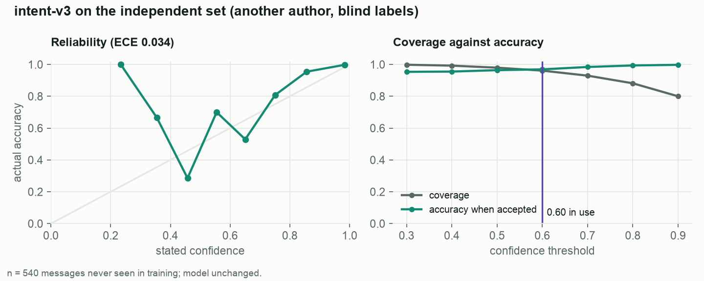

# intent-v3: calibration and threshold, out of sample

Independent set, n = 540 (another author; labels re-checked blind, κ = 1.0; [independent-v1](independent-v1.md)). Model unchanged; script `dispute_ops.ml.calibration`.

- Accuracy (model alone, no rules): **95.4%**; multi-class Brier score 0.065.
- Expected calibration error (10 bins): **0.034**.
- At the 0.60 threshold in use: coverage **96.1%**, accuracy when accepted **96.9%**.
- Some bins above 0.6 are less accurate than their stated confidence: see the table.
- n = 540 is the whole set; the 94.1% reported in independent-v1 is the full fallback reader (rules + model) on 525 of these messages.

| Threshold | Coverage | Accuracy when accepted |
|---|---|---|
| 0.3 | 99.8% | 95.4% |
| 0.4 | 99.3% | 95.5% |
| 0.5 | 98.0% | 96.4% |
| 0.6 | 96.1% | 96.9% |
| 0.7 | 93.0% | 98.4% |
| 0.8 | 88.1% | 99.4% |
| 0.9 | 80.0% | 99.8% |

| Confidence bin | n | Mean confidence | Accuracy |
|---|---|---|---|
| 0.2–0.3 | 1 | 0.23 | 1.00 |
| 0.3–0.4 | 3 | 0.35 | 0.67 |
| 0.4–0.5 | 7 | 0.46 | 0.29 |
| 0.5–0.6 | 10 | 0.55 | 0.70 |
| 0.6–0.7 | 17 | 0.65 | 0.53 |
| 0.7–0.8 | 26 | 0.75 | 0.81 |
| 0.8–0.9 | 44 | 0.86 | 0.95 |
| 0.9–1.0 | 432 | 0.98 | 1.00 |

| Language | n | Accuracy | Coverage at 0.60 | Accuracy when accepted |
|---|---|---|---|---|
| es | 270 | 95.6% | 96.7% | 96.9% |
| pt | 270 | 95.2% | 95.6% | 96.9% |

Below the threshold the keyword rules keep their reading and the policy's own confidence floor (0.6) sends
an unclear reason to a person; the model never decides alone.
